<div align="center">

  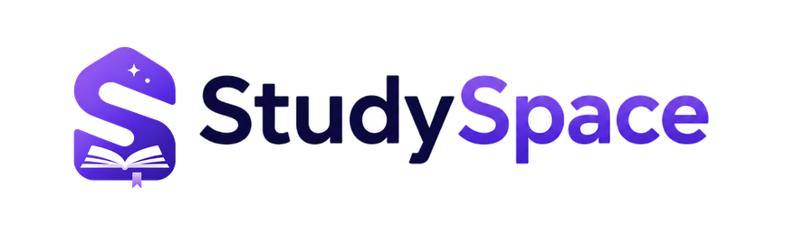

  <p><strong>Your semester, finally in one place.</strong></p>

  <p>
    An academic workspace for students that brings together timetable scheduling, attendance intelligence, lecture tracking with timestamped notes, focus timers, and course documents into a single synchronized operating system.
  </p>

  <p>
    <a href="https://studyspace4u.vercel.app"><strong>🌐 Live Demo</strong></a> &nbsp;&nbsp;•&nbsp;&nbsp;
    <a href="https://studyspace4u.vercel.app/api/download/android"><strong>📱 Download Android</strong></a>
  </p>

  <p>
    <a href="https://studyspace4u.vercel.app"></a>
    <a href="https://studyspace4u.vercel.app/api/download/android"></a>
  </p>

  <p>
    
    
    
    
    
    
    
    
  </p>

</div>

---

<div align="center">
  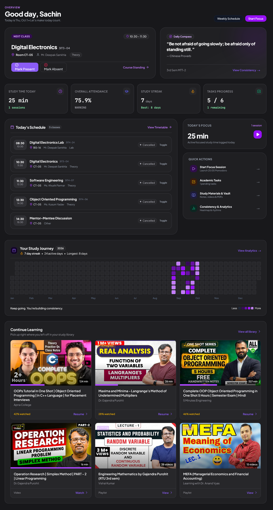
</div>

---

## The Problem: College Life is Scattered

University students and self-directed learners routinely juggle fragmented workflows across half a dozen disconnected tools:

- **Lecture videos** are watched on YouTube, lost inside algorithmic feeds and endless distraction rabbit holes.
- **Notes** are scribbled across loose scratchpads, chat messages, or separate note apps with zero connection to the specific timestamp of the lecture.
- **Tasks & assignments** sit in generic to-do apps with no awareness of the academic calendar or subjects.
- **Focus timers** live on phone widgets that get killed in the background or interrupted during browser navigation.
- **Attendance & timetables** are checked manually on university portal PDFs, leading to panic calculations before semester exams to determine whether you can safely miss a lecture.
- **Course documents & lecture slides** are buried in WhatsApp group chats and lost download folders.

**StudySpace unifies this entire academic lifecycle into one cohesive, distraction-free learning operating system across Web and Android.**

---

## The Solution: One Unified Workspace

StudySpace bridges the gap between daily university logistics and deep, focused study sessions. Whether you are reviewing weekly attendance margins, scanning your physical timetable with your phone camera, watching a 2-hour university lecture with timestamped seeking notes, or analyzing your 365-day study consistency, StudySpace provides a single, synchronized hub.

---

## Features Across the Student Workflow

### 1. PLAN — Timetable & Attendance Intelligence
- **Weekly Schedule Engine**: Configure recurring weekly slots (Monday to Sunday) with start/end times, faculty, room numbers, and subject course codes.
- **Ad-Hoc Schedule Exceptions**: Log cancelled lectures, reschedule classes to replacement windows, or inject extra revision sessions without breaking your recurring baseline.
- **Mathematical Bunk Allowance & Recovery Engine** ([`lib/attendance/calculations.ts`](lib/attendance/calculations.ts)):
  - **Safe Bunk Allowance ($M$)**: Exactly how many classes you can skip while remaining at or above your target percentage (e.g. 75% or 85%).
  - **Consecutive Recovery Requirement ($R$)**: Exactly how many consecutive classes you must attend to climb back to good academic standing.
  - **Tri-State Risk Machine**: Real-time visual status tags (**SAFE**, **WARNING**, **CRITICAL**).
- **Daily Class Timeline**: Dynamically resolves today's active schedule, taking into account cancellations and room shifts.
- **Multimodal AI Timetable OCR Scanner**: Photograph a printed university timetable; Google Gemini Flash vision extracts days, time slots, course names, and faculties into structured JSON with ephemeral in-memory privacy.

### 2. LEARN — YouTube Lecture Hub & Timestamped Notes
- **Server-Side Metadata Retrieval**: Pasting any YouTube URL securely retrieves high-res thumbnails, durations, channel names, and titles via Google YouTube Data API v3 on the server.
- **Global Catalog Deduplication**: Shared courses are deduplicated in `youtube_videos`, saving storage while keeping individual watch progress private in `saved_videos`.
- **Bidirectional Seeking Notes**: Take notes while a lecture plays; clicking any timestamp tag (e.g. `[14:28]`) jumps the player directly to that second.
- **Course Playlists**: Import full YouTube course playlists with batched item fetching, duration calculation, and unified watch tracking.

### 3. FOCUS — Pomodoro Suite & Flow State
- **Navigation-Persistent Chronometer**: Managed at the AppShell level (`TimerProvider`), so switching between Dashboard, Attendance, Tasks, and Videos never resets or interrupts your countdown.
- **Zero-Latency Web Audio API Synthesis**: Audio chime alerts are synthesized directly in the browser using the Web Audio API (`OscillatorNode` + `GainNode`), guaranteeing reliable chimes without network audio loading.
- **Automatic Lifecycle Logging**: Completed and interrupted focus sessions log automatically to `pomodoro_sessions`.

### 4. TRACK — Consistency & Study Analytics
- **365-Day Study Activity Heatmap**: Visual activity grid mapping study volume across 5 tiers (Level 0 to Level 4) with a 20-minute daily qualifying threshold.
- **100-Point Consistency Score Algorithm**: Algorithmic consistency index factoring 30-day active days (40 pts), current streak (35 pts), and weekly goal pace (25 pts).
- **Diurnal Rhythm Breakdown**: Dissects focus sessions into Morning (05:00–12:00), Afternoon (12:00–17:00), Evening (17:00–21:00), and Night (21:00–05:00) segments.

### 5. ORGANIZE — Academic Tasks, Resources & Documents
- **Subject-Aware Task Planner**: Manage assignments, lab reports, and exam prep with priorities (Low, Medium, High), due dates, and completion tracking.
- **Web Resource Library**: Bookmark documentation, tutorials, and syllabus links with automatic favicon resolution.
- **Private Document Vault**: Upload and view lecture PDFs and study slides (up to 50MB) secured with private storage and 10-minute short-lived presigned URLs.

### 6. CONNECT — Web + Android Companion Ecosystem
- **Offline-First SQLite Architecture**: The native Flutter Android companion client reads and writes from a local SQLite database (`studyspace_offline.db`), delivering `<16ms` touch-to-render performance.
- **Instant Haptic Marking**: Tapping `[ ✓ Present ]` marks attendance immediately with tactile vibration feedback.
- **Idempotent Background Sync**: Mutations are queued in `sync_queue` with deterministic keys (`att_${userId}_${subjectId}_${date}_${time}`) and automatically synced via `SyncEngine` upon network reconnect.
- **Local Device Notifications**: 07:30 daily morning schedule digest, 10-minute pre-class reminders, and post-class attendance verification prompts running entirely on-device without external push servers.

---

## Web + Android Companion Ecosystem

```
┌────────────────────────────────────────────────────────────────────────┐
│                   STUDYSPACE CROSS-PLATFORM SYSTEM                     │
└────────────────────────────────────────────────────────────────────────┘

            NEXT.JS 16 WEB APP                   FLUTTER ANDROID APP
      (React 19 Server Components)               (Native Android API 21-34)
                   │                                         │
                   ▼                                         ▼
            PostgREST & Actions                      Offline SQLite Cache
                   │                                (studyspace_offline.db)
                   │                                         │
                   │                                         ▼
                   │                                    SyncEngine
                   │                                (Idempotent Queue)
                   │                                         │
                   └───────────────────┬─────────────────────┘
                                       │
                                       ▼
                             SUPABASE POSTGRESQL
                       (Strict Row Level Security &
                          Realtime CDC Replication)
```

---

## 📱 Android App

StudySpace is also available as an Android application for studying on the go. Built as an offline-first mobile companion, it features on-device SQLite caching, instant haptic attendance marking, background synchronization, and local timetable notification alerts.

👉 **[Download StudySpace for Android](https://studyspace4u.vercel.app/api/download/android)**

---

## Visual Tour & Interface Showcase

<div align="center">
  <table>
    <tr>
      <td width="50%">
        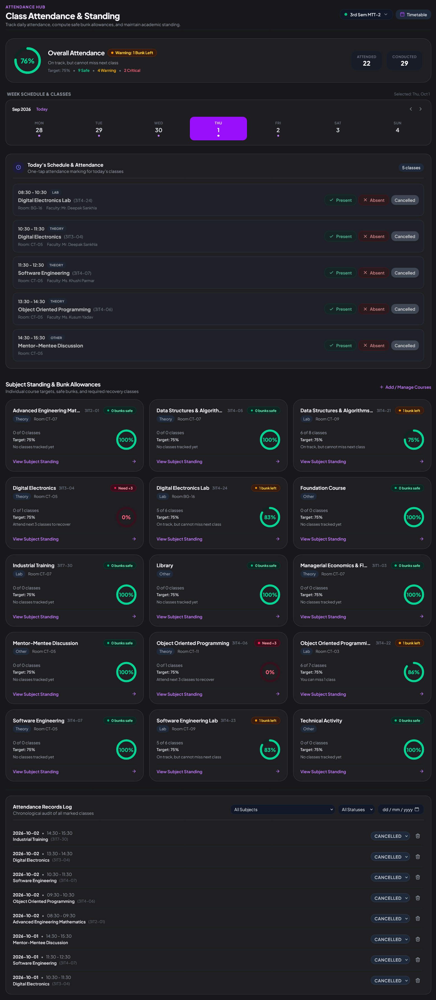
        <p align="center"><em>Attendance Master & Safe Bunk Allowance</em></p>
      </td>
      <td width="50%">
        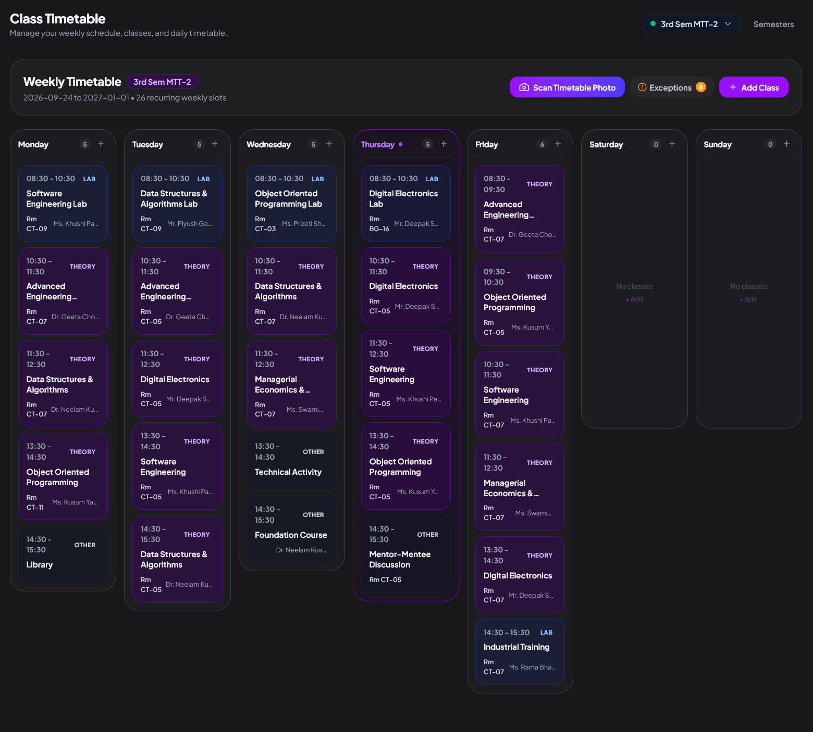
        <p align="center"><em>Weekly Timetable Grid & Schedule Resolution</em></p>
      </td>
    </tr>
    <tr>
      <td width="50%">
        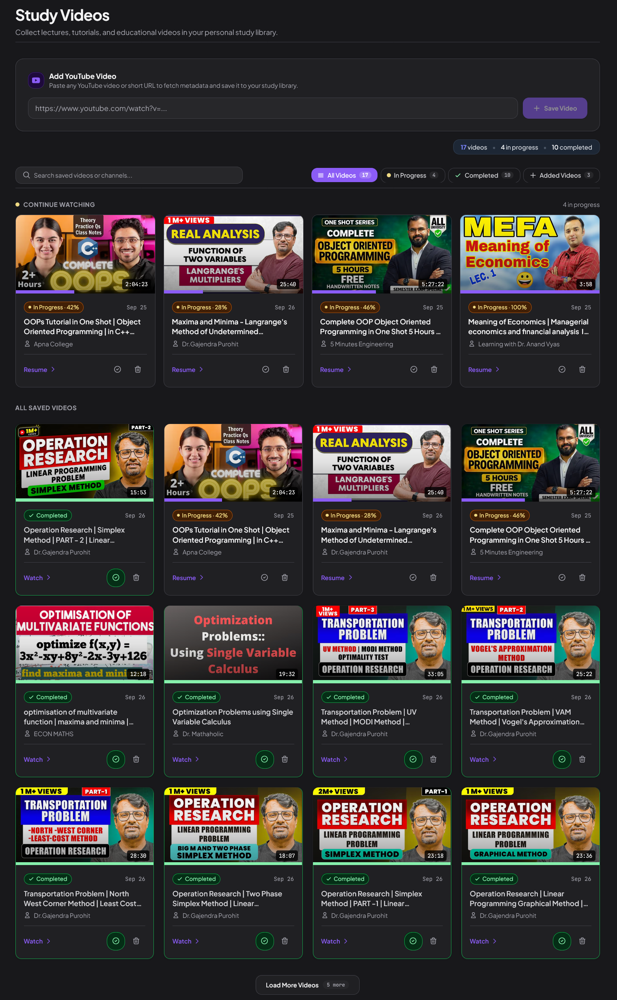
        <p align="center"><em>Lecture Hub with Contextual Timestamped Notes</em></p>
      </td>
      <td width="50%">
        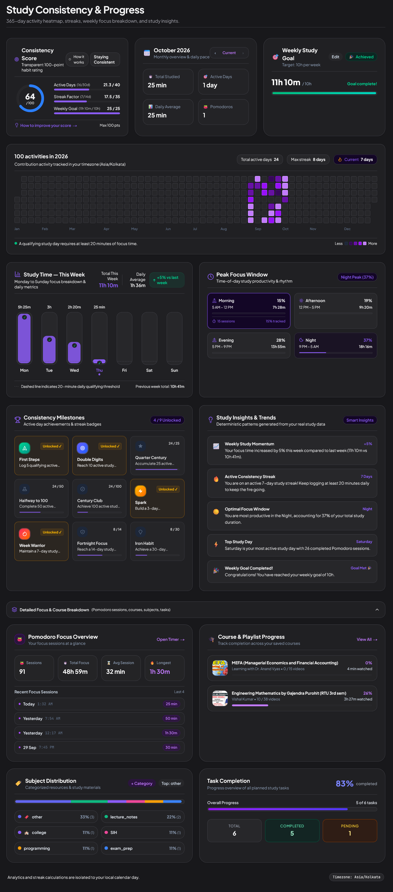
        <p align="center"><em>365-Day Heatmap & Consistency Score (0–100)</em></p>
      </td>
    </tr>
    <tr>
      <td width="50%">
        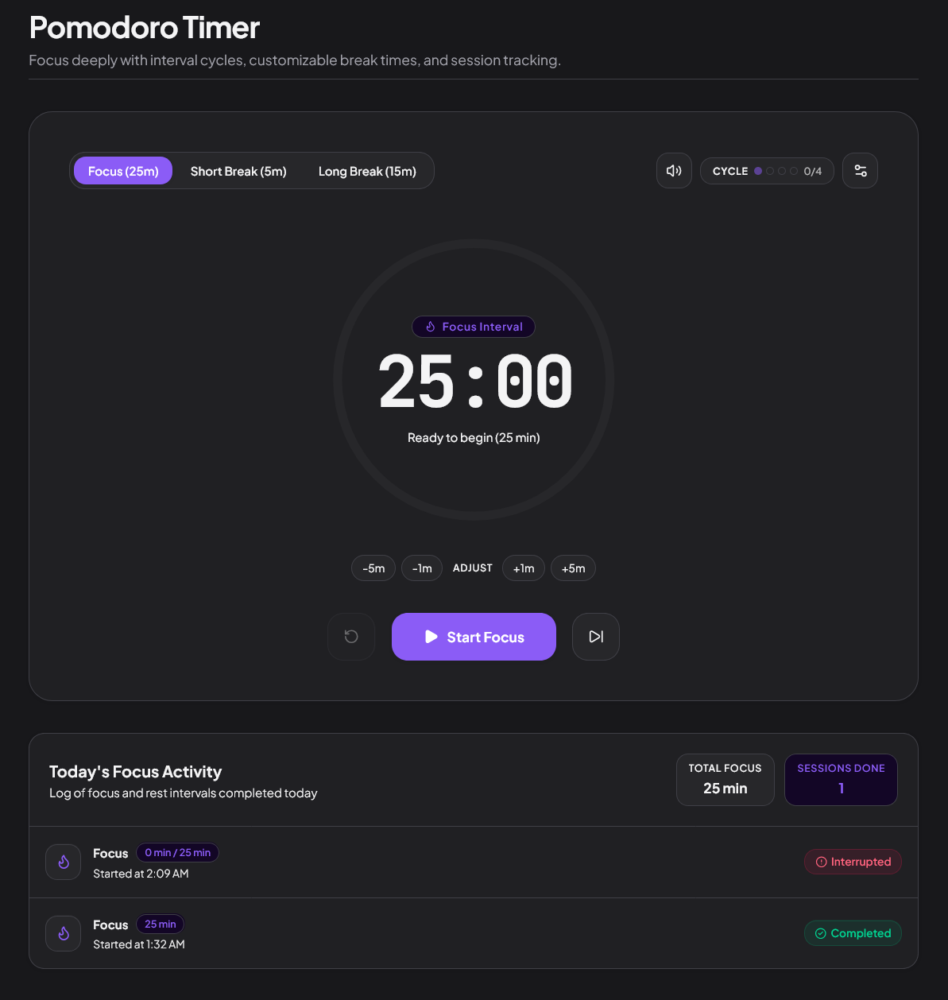
        <p align="center"><em>Navigation-Persistent Pomodoro Focus Suite</em></p>
      </td>
      <td width="50%">
        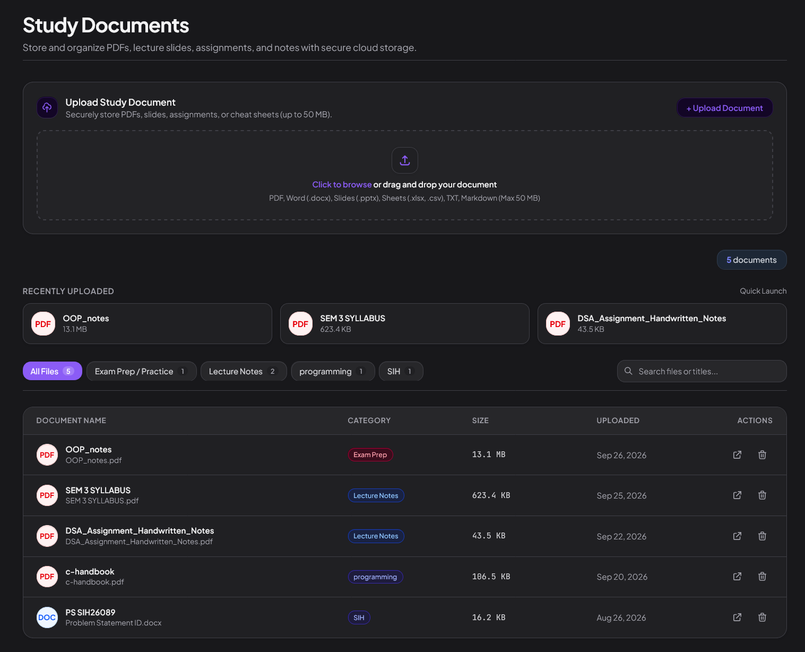
        <p align="center"><em>Private Study Document Vault (Presigned URLs)</em></p>
      </td>
    </tr>
  </table>
</div>

### Mobile Companion Experience (Android Native)

<div align="center">
  <table border="0">
    <tr>
      <td align="center">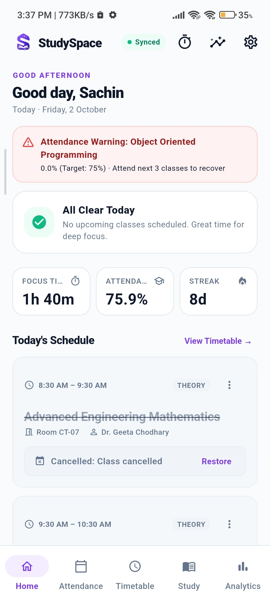<br /><sub>Home Digest</sub></td>
      <td align="center">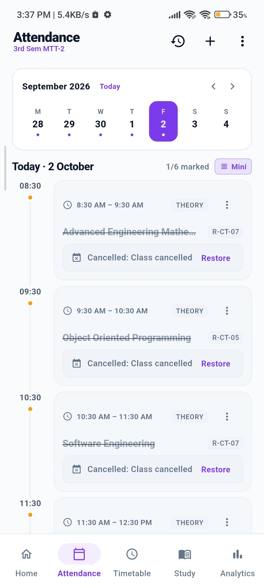<br /><sub>Instant Attendance</sub></td>
      <td align="center">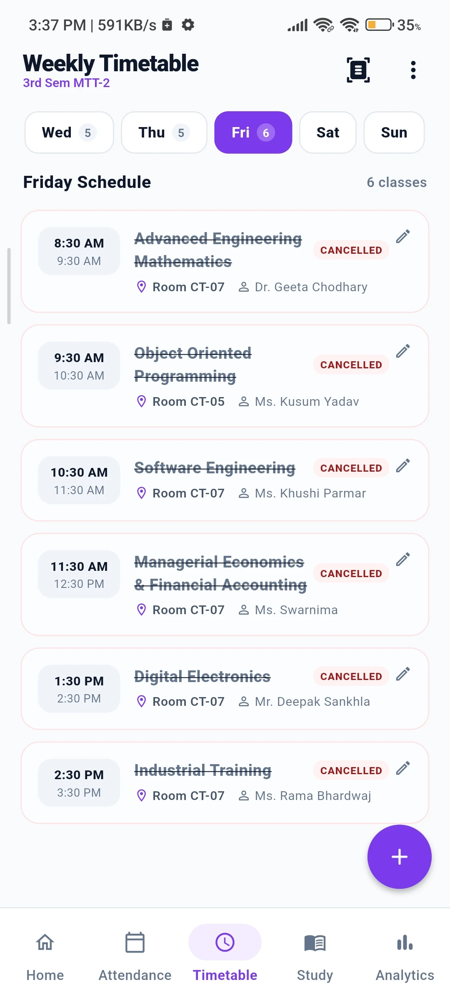<br /><sub>Weekly Timetable</sub></td>
      <td align="center">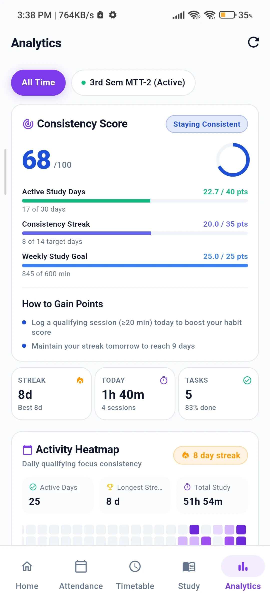<br /><sub>Mobile Analytics</sub></td>
    </tr>
  </table>
</div>

---

## System Architecture

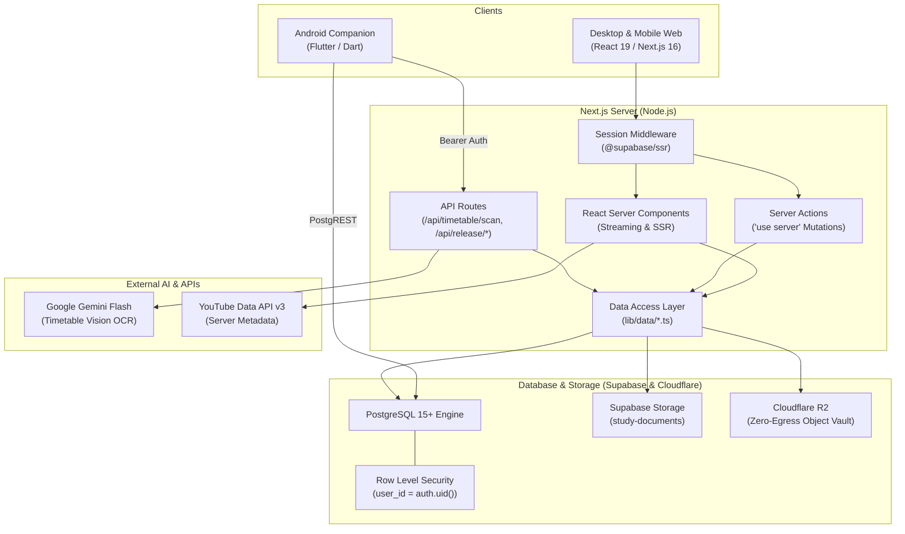

For the comprehensive architecture breakdown, see [`docs/architecture.md`](docs/architecture.md).

---

## Technology Stack

| Layer | Technology | Purpose |
| :--- | :--- | :--- |
| **Web Framework** | [Next.js 16](https://nextjs.org/) (App Router) | Server-side rendering, streaming RSCs, and Server Actions |
| **Frontend Runtime** | [React 19](https://react.dev/) | Component architecture, optimistic UI, hooks, and transitions |
| **Language** | [TypeScript 5](https://www.typescriptlang.org/) | Strict static typing across models, actions, and API boundaries |
| **Web Styling** | [Tailwind CSS v4](https://tailwindcss.com/) | Modern CSS variable theming with `@tailwindcss/postcss` |
| **Database** | [PostgreSQL 15+](https://www.postgresql.org/) via [Supabase](https://supabase.com/) | Relational database with strict Row Level Security (RLS) |
| **Authentication** | [Supabase Auth](https://supabase.com/auth) | PKCE cookie sessions, JWT verification, and user management |
| **Object Storage** | [Supabase Storage](https://supabase.com/storage) + [Cloudflare R2](https://www.cloudflare.com/developer-platform/r2/) | Dual storage: private user buckets + zero-egress S3 vault |
| **Mobile Client** | [Flutter 3.19+](https://flutter.dev/) (Dart 3.3+) | Cross-platform Android client targeting API levels 21–34 |
| **Local Persistence** | [SQLite](https://www.sqlite.org/) via `sqflite` | Offline-first local mobile database with sync queue |
| **External APIs** | [YouTube Data API v3](https://developers.google.com/youtube/v3) | Server-only video and playlist metadata resolution |
| **Multimodal AI** | [Google Gemini](https://ai.google.dev/) (Flash Vision) | Structured JSON extraction from timetable photos |
| **Hosting & CI/CD** | [Vercel](https://vercel.com/) + [GitHub Actions](https://github.com/features/actions) | Global edge deployment and automated Android APK builds |

---

## Engineering Highlights

### 1. Zero Row-Level Security Bypass
Every user-owned table (`tasks`, `attendance_records`, `timetable_slots`, `timetable_exceptions`, `pomodoro_sessions`, `documents`, `notes`) enforces `user_id = auth.uid()` at the PostgreSQL kernel level. The `service_role` key is **never** bundled or referenced in client-side bundles.

### 2. Ephemeral Multimodal AI Vision
The AI timetable scanner (`/api/timetable/scan`) accepts photo uploads and streams bytes in-memory to Google Gemini Flash. The image is parsed against a strict schema and discarded immediately. No student photos or camera captures are ever stored on disk or in cloud buckets.

### 3. Dual Object Storage with Zero Egress
Small and standard document uploads utilize Supabase Storage with folder-level RLS policies. Large study assets and public Android release APKs utilize Cloudflare R2 via AWS S3 SDK presigned URLs (`@aws-sdk/s3-request-presigner`), eliminating bandwidth egress fees.

### 4. Navigation-Persistent Focus Chronometer
Instead of isolating the timer inside the Pomodoro page, `TimerProvider` is mounted at the App Router layout boundary (`app/(app)/layout.tsx`). Students can explore resources, mark attendance, or manage tasks while their focus session ticks in the background.

### 5. Automated Android Release Pipeline
Every tagged release triggers GitHub Actions workflows (`.github/workflows/release-android.yml`) that compile split-per-abi Android APKs, sign artifacts, generate SHA-256 hashes, and upload releases directly to Cloudflare R2. The web application checks `/api/release/latest` and serves in-app update notifications.

---

## Repository Structure

```
StudySpace/
├── app/                                 # Next.js 16 App Router root
│   ├── (auth)/                          # Unauthenticated route group (login, signup)
│   ├── (app)/                           # Protected application route group (auth session verified)
│   │   ├── dashboard/                   # Aggregated overview, live timetable strip, quick actions
│   │   ├── attendance/                  # Attendance tracking, risk cards, subject drill-downs
│   │   ├── timetable/                   # Weekly timetable grid, semester manager, AI scan modal
│   │   ├── tasks/                       # Task planner with priority and status filters
│   │   ├── pomodoro/                    # Fullscreen Pomodoro timer and session logs
│   │   ├── videos/                      # YouTube lecture hub with timestamped notes
│   │   ├── playlists/                   # YouTube playlist importer and sequential player
│   │   ├── notes/                       # Centralized timestamp notes library
│   │   ├── resources/                   # Bookmarked web learning links
│   │   ├── documents/                   # Private PDF & study documents vault
│   │   ├── analytics/                   # 365-day heatmap, consistency score, study trends
│   │   └── settings/                    # Preferences, timer durations, device management
│   ├── api/                             # Server API routes
│   │   ├── timetable/scan/              # Multimodal AI timetable OCR endpoint
│   │   ├── release/latest/              # Mobile release manifest and update checker
│   │   ├── download/android/            # Android APK direct download redirect
│   │   └── user/                        # Privacy controls: export, delete-data, delete-account
│   ├── layout.tsx                       # Root HTML layout with theme provider
│   └── page.tsx                         # Public product showcase and landing experience
│
├── components/                          # React Component Library
│   ├── attendance/                      # TodayClassesCard, SubjectAttendanceCard, HistoryModal...
│   ├── timetable/                       # TimetableGrid, SlotModal, ScannedTimetableReview...
│   ├── dashboard/                       # ContinueLearning, TaskList, MetricCard, LiveClock...
│   ├── pomodoro/                        # PomodoroTimer, PomodoroSettings, CompletionModal...
│   ├── videos/                          # VideoPlayer, TimestampNotesList, VideoCard...
│   ├── landing/                         # ProductShowcaseSection, BunkSimulator, ThemeCompare...
│   └── layout/                          # AppShell, AppSidebar, MobileHeader, MobileNavDrawer
│
├── lib/                                 # Domain Logic & Infrastructure
│   ├── actions/                         # Next.js Server Actions ('use server')
│   ├── ai/                              # Google Gemini multimodal timetable vision prompt & schema
│   ├── attendance/                      # Bunk allowance, recovery calculations, daily class resolver
│   ├── data/                            # Supabase PostgREST Data Access Layer (DAL)
│   ├── pomodoro/                        # TimerContext store & Web Audio API synthesizer
│   ├── storage/                         # Cloudflare R2 S3 client & presigned URL generators
│   └── supabase/                        # Server, browser, and middleware Supabase client factories
│
├── mobile/                              # Flutter Android Application
│   ├── lib/                             # Core SQLite helper, SyncEngine, attendance & timetable UI
│   ├── android/                         # Android native project configuration (API 21-34)
│   └── pubspec.yaml                     # Mobile dependencies (supabase_flutter, sqflite, provider)
│
├── supabase/                            # Database Schemas & Migrations
│   ├── schema.sql                       # Complete initial DDL (13 tables, RLS policies, triggers)
│   └── migrations/                      # Incremental migrations (attendance, R2, user devices)
│
├── public/                              # Static Web Assets
│   ├── branding/                        # Official StudySpace marks and logos
│   ├── screenshots/                     # Real production screenshots (dark, light, mobile)
│   └── images/app/                      # High-resolution optimized application previews
│
├── docs/                                # Technical Documentation & Showcase
│   ├── architecture.md                  # Comprehensive system architecture & data flow
│   ├── development.md                   # Local development manual & operational commands
│   ├── android-release.md               # Mobile release & Cloudflare R2 deployment operations
│   ├── screenshots/                     # Standalone repository showcase screenshots
│   └── design/                          # UI/UX design blueprints and component audits
│
├── SECURITY.md                          # Vulnerability reporting & security guidelines
├── CONTRIBUTING.md                      # Development workflow and pull request guidelines
└── CHANGELOG.md                         # Semantic version history and feature changelog
```

---

## Getting Started

### Prerequisites
- [Node.js](https://nodejs.org/) (v20.x or later)
- [npm](https://www.npmjs.com/) (v10.x or later)
- A [Supabase](https://supabase.com/) account & project
- *(Optional for lecture metadata)*: [Google Cloud YouTube Data API v3 key](https://console.cloud.google.com/)
- *(Optional for AI timetable OCR)*: [Google Gemini API key](https://aistudio.google.com/)
- *(Optional for mobile development)*: [Flutter SDK](https://flutter.dev/) (v3.19+) & Android SDK

### 1. Clone the Repository
```bash
git clone https://github.com/sachin06dev/StudySpace.git
cd StudySpace
```

### 2. Install Web Dependencies
```bash
npm install
```

### 3. Configure Environment Variables
Copy `.env.example` to `.env.local`:
```bash
cp .env.example .env.local
```

### Environment Variables Reference

| Variable Name | Purpose | Exposure |
| :--- | :--- | :--- |
| `NEXT_PUBLIC_SUPABASE_URL` | Supabase project endpoint URL (`https://<ref>.supabase.co`) | **PUBLIC** (Client & Server) |
| `NEXT_PUBLIC_SUPABASE_ANON_KEY` | Supabase anonymous publishable API key | **PUBLIC** (Client & Server) |
| `YOUTUBE_API_KEY` | Google Cloud YouTube Data API v3 key for lecture metadata | **SERVER-ONLY SECRET** |
| `GEMINI_API_KEY` | Google Gemini multimodal vision key for AI timetable scanning | **SERVER-ONLY SECRET** |
| `OPENAI_API_KEY` | Optional OCR fallback key for timetable image extraction | **SERVER-ONLY SECRET** |
| `R2_ACCOUNT_ID` | Cloudflare account ID for R2 storage bucket | **SERVER-ONLY SECRET** |
| `R2_ACCESS_KEY_ID` | Cloudflare R2 S3 API access key | **SERVER-ONLY SECRET** |
| `R2_SECRET_ACCESS_KEY` | Cloudflare R2 S3 API secret access key | **SERVER-ONLY SECRET** |
| `R2_BUCKET_NAME` | Cloudflare R2 bucket name (`studyspace-documents`) | **SERVER-ONLY SECRET** |
| `SUPABASE_SERVICE_ROLE_KEY` | Optional: admin API fallback for account purge | **SERVER-ONLY SECRET** |
| `NEXT_PUBLIC_SITE_URL` | Canonical base URL for OpenGraph metadata and redirects | **PUBLIC** (Client & Server) |

### 4. Initialize Database Schema
1. Open your Supabase Dashboard and navigate to the **SQL Editor**.
2. Run the base schema located at [`supabase/schema.sql`](supabase/schema.sql).
3. Execute the incremental migrations in [`supabase/migrations/`](supabase/migrations/) to provision attendance tables, semester constraints, and device sync tables.

### 5. Launch the Development Server
```bash
npm run dev
```
Open [http://localhost:3000](http://localhost:3000) to view StudySpace.

---

## Running the Android Companion App

To run the native Android companion locally:

```bash
cd mobile

# Fetch Flutter dependencies
flutter pub get

# Run on connected device or emulator
flutter run

# Build release APK
flutter build apk --split-per-abi
```

For detailed production build and signing instructions, see [`docs/android-release.md`](docs/android-release.md).

---

## Project Commands

| Command | Description |
| :--- | :--- |
| `npm run dev` | Starts Next.js development server with hot reloading on port 3000 |
| `npm run build` | Compiles optimized Next.js production build |
| `npm run start` | Runs the compiled production server |
| `npm run lint` | Runs ESLint across all TypeScript and React files |
| `npm run security` | Runs automated defense-in-depth security invariants and secret scanning |
| `npx tsx scripts/test-attendance.ts` | Runs attendance calculation unit tests |
| `npx tsx scripts/test-edge-cases.ts` | Runs boundary condition tests for attendance math |

---

## Security

StudySpace enforces strict Row Level Security (RLS) on all user-owned tables, server-only secret encapsulation, short-lived presigned storage URLs, and ephemeral in-memory processing for multimodal AI scans.

For vulnerability reporting and detailed security guidelines, refer to [`SECURITY.md`](SECURITY.md).

---

## Contributing

Contributions, bug reports, and feature proposals are welcome! Please read [`CONTRIBUTING.md`](CONTRIBUTING.md) for guidelines on code conventions, branching strategy, and pull requests.

---

## Realistic Roadmap

- [ ] **Offline PDF Caching**: Encrypted local cache for frequently accessed course documents on Android.
- [ ] **Native iOS Companion**: Port Flutter companion target to iOS with native Apple Sign-In and widgets.
- [ ] **LMS Calendar Export**: One-click iCal/Google Calendar subscription URL for resolved class timetables.
- [ ] **Canvas / Moodle Webhook Sync**: Optional assignment deadline importing from university LMS platforms.

---

## Try StudySpace

Access the live ecosystem across web and Android:

- **🌐 Web**: [https://studyspace4u.vercel.app](https://studyspace4u.vercel.app)
- **📱 Android**: [https://studyspace4u.vercel.app/api/download/android](https://studyspace4u.vercel.app/api/download/android)

---

## License

This project is licensed under the **MIT License** — see the [LICENSE](LICENSE) file for details.

---

## Author & Acknowledgments

Crafted by **[Sachin](https://github.com/sachin06dev)** ([@sachin06dev](https://github.com/sachin06dev)).

Special thanks to the open-source communities powering [Next.js](https://nextjs.org/), [Supabase](https://supabase.com/), [Tailwind CSS](https://tailwindcss.com/), [Flutter](https://flutter.dev/), and [Lucide Icons](https://lucide.dev/).
