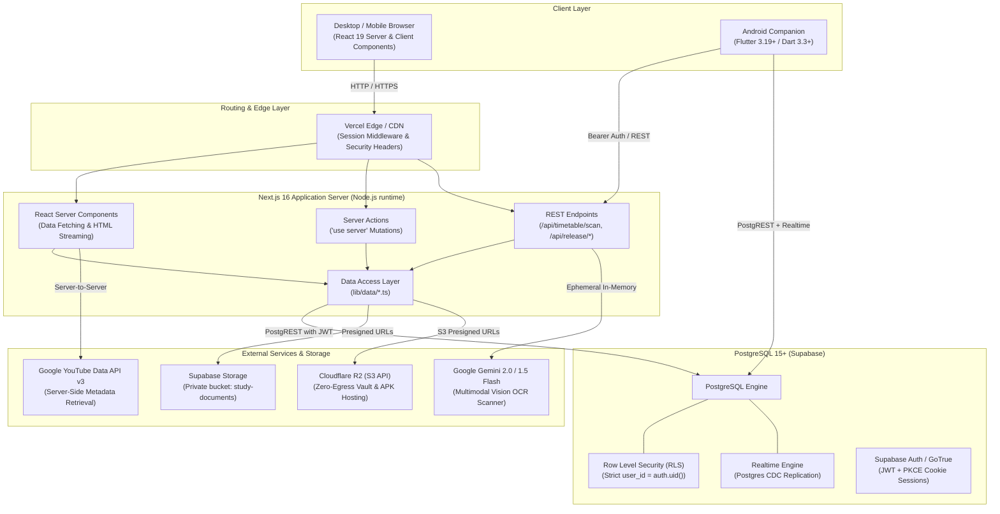
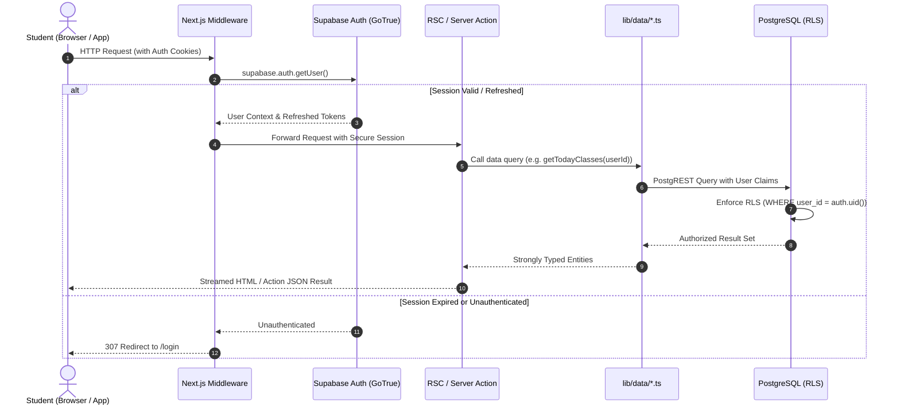
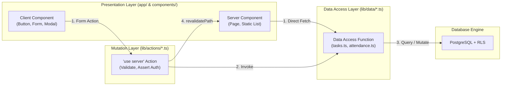
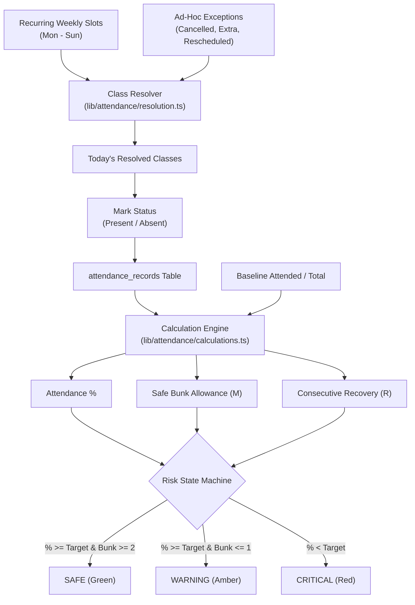
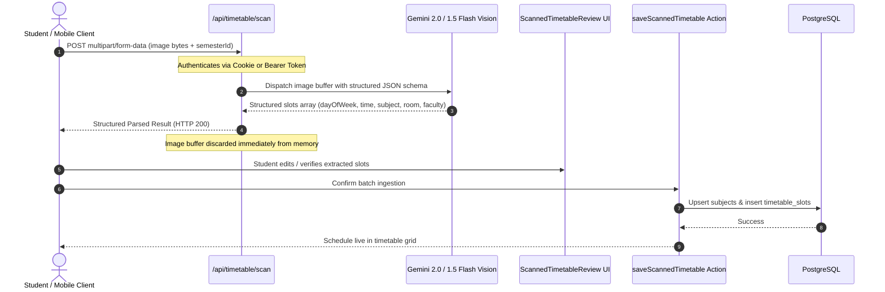
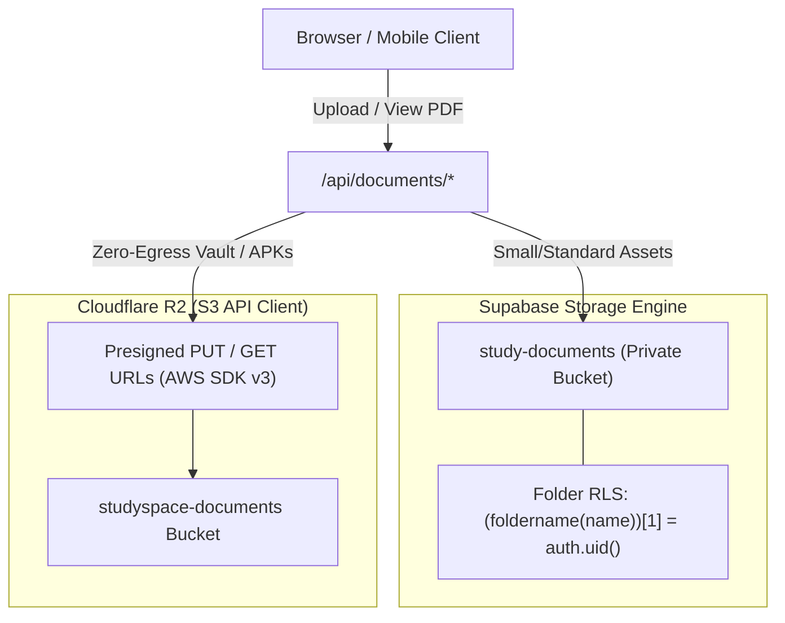
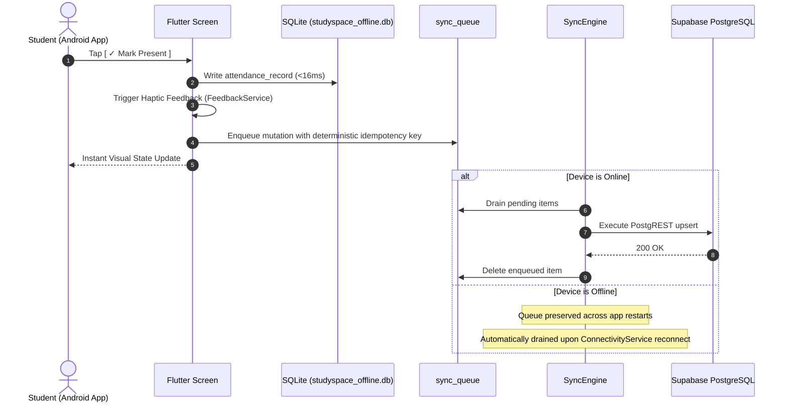

# StudySpace — System Architecture & Technical Specification

> **Single Source of Truth**: This document details the end-to-end architecture, data flow, engineering decisions, and security model of the **StudySpace** platform across both the Next.js web application and the Flutter Android companion.

---

## 1. High-Level Architecture Overview

StudySpace is designed as an integrated academic workspace combining server-rendered web performance with offline-first mobile reliability.



---

## 2. Request & Authentication Lifecycle



### Authentication Architecture
1. **Next.js Middleware (`middleware.ts` & `lib/supabase/middleware.ts`)**:
   - Intercepts all incoming requests.
   - Refreshes expired JSON Web Tokens (JWT) transparently using `@supabase/ssr`.
   - Propagates session cookies back to both the request headers (for downstream Server Components) and the response headers (for the browser).
2. **Protected App Shell (`app/(app)/layout.tsx`)**:
   - Performs a server-side assertion: `const { data: { user } } = await supabase.auth.getUser()`.
   - If null, triggers immediate server-side redirection to `/login`.
   - Wraps authenticated children in `TimerProvider` (persisting focus timer across client-side route transitions) and `TimezoneSync` (aligning PostgreSQL timestamps with the student's local IANA timezone).

---

## 3. Data Access Layer & Mutation Boundary

To prevent code duplication, SQL injection, and architectural drift, StudySpace strictly isolates database access from the UI.



### Architectural Contract
- **Zero Inline Database Calls**: UI components never call `supabase.from(...)` directly.
- **Server Actions for Mutations**: All client mutations call Server Actions in `lib/actions/*.ts`, which return standardized response envelopes:
  ```typescript
  type ActionResponse<T> = {
    success: boolean
    data?: T
    error?: string
  }
  ```
- **Cache Invalidation**: Server Actions invoke `revalidatePath()` upon successful database write, triggering Next.js incremental cache purging and instant UI updates.

---

## 4. Key Subsystems & Engineering Highlights

### 4.1 Academic Attendance & Timetable Intelligence

University students face strict attendance minimums (e.g., 75% or 85%). StudySpace implements a deterministic mathematical model in `lib/attendance/calculations.ts` guaranteeing precision.



#### Mathematical Formulas
1. **Attendance Percentage**:
   $$\text{Percentage} = \frac{\text{Baseline Attended} + \text{Live Present}}{\text{Baseline Total} + \text{Live Present} + \text{Live Absent}} \times 100$$
   *(Cancelled classes are excluded entirely from both numerator and denominator).*
2. **Safe Bunk Allowance ($M$)**:
   $$M = \max\left(0, \; \left\lfloor \frac{\text{Attended} \times 100}{\text{Target}} - \text{Total} \right\rfloor\right)$$
3. **Recovery Requirement ($R$)**:
   $$R = \max\left(0, \; \left\lceil \frac{\text{Target} \times \text{Total} - 100 \times \text{Attended}}{100 - \text{Target}} \right\rceil\right)$$
   *(If $\text{Target} = 100\%$ and any absence exists, $R = \infty$).*

---

### 4.2 Multimodal AI Timetable OCR Scanner



- **Zero-Storage Privacy**: Timetable image buffers are kept strictly in ephemeral server memory during the inference call and discarded immediately. No user images are written to disk or uploaded to S3.
- **Dual Authentication**: Accepts browser cookie sessions or HTTP `Authorization: Bearer <access_token>` headers, enabling both web modals and native Android camera invocations.

---

### 4.3 YouTube Lecture Hub & Timestamped Notes

```mermaid
graph TD
    User["Student"] -->|Enters YouTube URL| NextServer["Next.js Server API<br/>(/api/youtube/video)"]
    NextServer -->|Server-to-Server with YOUTUBE_API_KEY| YouTubeAPI["Google YouTube Data API v3"]
    YouTubeAPI -->|Title, Channel, Thumbnail, ISO Duration| NextServer
    NextServer -->|Upsert Metadata| GlobalCatalog["youtube_videos (Global Shared Catalog)"]
    NextServer -->|Associate User Record| SavedVideos["saved_videos (User-Specific Progress)"]

    User -->|Plays Lecture| IFramePlayer["YouTube IFrame Player"]
    IFramePlayer -->|Periodic Progress Sync| ProgressSave["Save watch_progress_seconds"]

    User -->|Adds Timestamped Note| NoteEditor["Timestamp Note Editor"]
    NoteEditor -->|Captures player.getCurrentTime()| TimestampNote["video_timestamp_notes Row"]

    User -->|Clicks Existing Note [04:15]| PlayerSeek["player.seekTo(255, true)"]
```

- **Global Catalog Deduplication**: Lectures and playlists saved by multiple users reference shared rows in `youtube_videos` and `youtube_playlists`, eliminating redundant metadata queries and database bloat.
- **Bidirectional Seeking**: Every note records `timestamp_seconds`. Clicking any note immediately jumps the embedded player to that exact moment.

---

### 4.4 Pomodoro Focus Engine & Persistence

- **State Machine**: Managed via React Context (`TimerProvider` in `lib/pomodoro/timerStore.tsx`).
- **Persistence Across Navigation**: Because `TimerProvider` is mounted at `app/(app)/layout.tsx`, navigation between Dashboard, Attendance, Tasks, and Videos does not disrupt active countdown intervals.
- **Audio Synthesis**: Complete audio notifications synthesized locally via the **Web Audio API** (`OscillatorNode` + `GainNode`), guaranteeing zero external audio asset loading failures or latency.
- **Automatic Lifecycle Logging**: Focus sessions, short breaks, and long breaks automatically persist to `pomodoro_sessions` upon completion, cancellation, or interruption.

---

### 4.5 Dual Object Storage Architecture



- **Supabase Storage**: Private `study-documents` bucket isolated by student UUID path prefix: `<user_id>/<document_uuid>/<filename>`.
- **Cloudflare R2**: Integrated using `@aws-sdk/client-s3` and `@aws-sdk/s3-request-presigner`. Generates 10-minute temporary presigned upload/download URLs with **zero egress bandwidth costs**.

---

### 4.6 Mobile Ecosystem & Offline-First Sync (`/mobile`)

The Android mobile client is built with Flutter and mirrors 100% of the web platform's data models and calculation logic.



- **Idempotency Keys**: Mutation items in `sync_queue` use deterministic keys (e.g. `att_${userId}_${subjectId}_${date}_${time}`) ensuring safe network retries without duplicate record creation.
- **Local Push Notifications**: Scheduled on-device using `flutter_local_notifications` (`AndroidScheduleMode.inexactAllowWhileIdle`) requiring zero external background server daemons.

---

## 5. Directory Blueprint & Architectural Responsibilities

| Directory | Layer | Architectural Responsibility |
| :--- | :--- | :--- |
| `app/` | Routing & Pages | Next.js App Router root: layouts, route groups `(app)` and `(auth)`, public marketing landing page, and legal pages. |
| `app/api/` | API Gateways | Server API endpoints: `/api/timetable/scan`, `/api/documents/*`, `/api/download/*`, `/api/release/*`, and `/api/user/*`. |
| `components/` | Presentation | Modular React components organized by feature (`attendance`, `timetable`, `dashboard`, `pomodoro`, `videos`, `landing`, `layout`). |
| `lib/actions/` | Mutations | Next.js Server Actions (`"use server"`). Enforce auth validation, execute mutations, and revalidate cache. |
| `lib/data/` | Data Access | PostgREST DAL. Encapsulates all Supabase queries, enforcing clean separation from UI components. |
| `lib/attendance/` | Domain Logic | Core attendance mathematics (bunk allowances, recovery thresholds, risk state machines, daily class resolution). |
| `lib/ai/` | Intelligence | Multimodal Gemini / OpenAI OCR integration for university timetable parsing. |
| `lib/storage/` | Storage Bridge | Cloudflare R2 S3 SDK client and presigned URL generators. |
| `lib/supabase/` | Database Clients | Supabase client factories for browser (`client.ts`), Server Components (`server.ts`), and middleware. |
| `mobile/` | Android App | Flutter client with offline SQLite cache, sync engine, local notifications, and Android build scripts. |
| `supabase/` | Database Schema | SQL migrations, initial DDL schemas (`schema.sql`), performance indexes, and RLS policies. |
| `public/` | Static Assets | Brand identity marks, dark/light production screenshots, optimized WebP app previews, and icons. |
| `docs/` | Documentation | Architecture specifications, Android release operations (`android-release.md`), and design blueprints (`docs/design/`). |

---

## 6. Security & Defense-in-Depth Model

1. **Row Level Security (RLS)**:
   - Configured on 100% of user-owned tables.
   - Policies verify `auth.uid() = user_id` at the database kernel level.
   - The Supabase `service_role` key is **never** bundled or referenced in client-side code.
2. **Server-Side Secret Encapsulation**:
   - `YOUTUBE_API_KEY`, `GEMINI_API_KEY`, `OPENAI_API_KEY`, `R2_ACCESS_KEY_ID`, and `R2_SECRET_ACCESS_KEY` are strictly server-side variables without `NEXT_PUBLIC_` prefixes.
3. **HTTP Hardening (`next.config.ts`)**:
   - `Content-Security-Policy`: Restricts scripts, frames, and connections to verified endpoints.
   - `Strict-Transport-Security`: Enforces 2-year HSTS with preloading.
   - `X-Frame-Options: DENY`: Prevents clickjacking attacks.
   - `X-Content-Type-Options: nosniff`: Prevents MIME-sniffing exploits.
   - `Permissions-Policy`: Disables camera, microphone, and geolocation by default.
